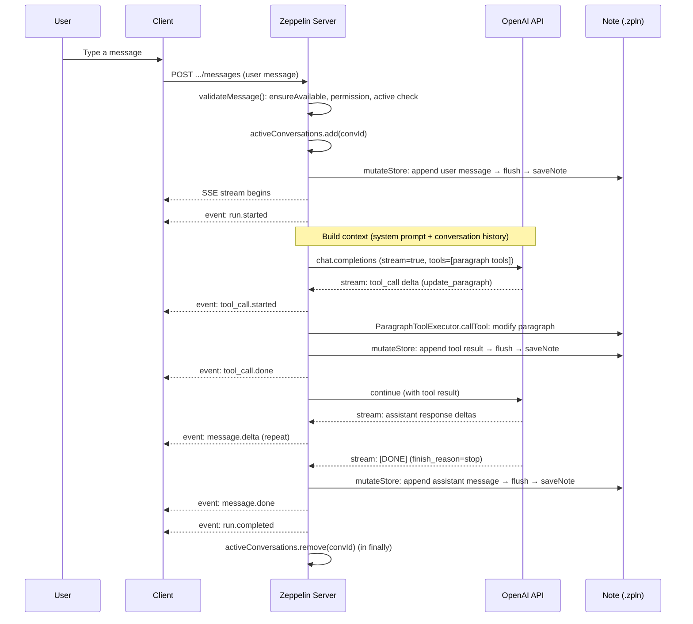
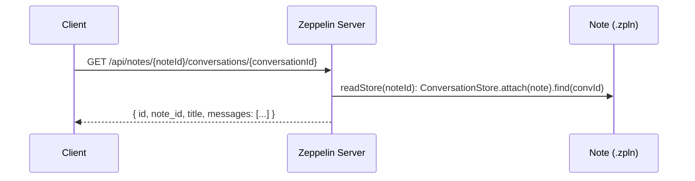

<!--
Licensed under the Apache License, Version 2.0 (the "License");
you may not use this file except in compliance with the License.
You may obtain a copy of the License at

http://www.apache.org/licenses/LICENSE-2.0
-->

# Notebook Assistant — System Sequence Design

## Overview

Per-notebook AI chat. Each notebook may host multiple conversations; conversation
data is persisted as JSON inside a hidden paragraph of the same notebook.
The LLM is OpenAI (Chat Completions), and paragraph read/write tools let the
model manipulate the notebook directly.

---

## Architecture

```
Browser (Angular)
    │  REST + SSE
    ▼
Zeppelin Server (Java)
    ├── AssistantConversationRestApi  (CRUD)
    ├── AssistantMessageRestApi       (list + SSE send)
    ├── NotebookAssistantService      (business logic, per-note locking)
    │     ├── ConversationStore       (hidden-paragraph domain façade)
    │     ├── ConversationJsonCodec   (wire format)
    │     ├── ParagraphToolExecutor   (tool routing)
    │     └── OpenAiClient            (SSE bridge to OpenAI)
    │
    │  OpenAI API (HTTPS)
    ▼
OpenAI
    │
    ├── tool: list_paragraphs
    ├── tool: get_paragraph
    ├── tool: add_paragraph
    ├── tool: update_paragraph
    └── tool: delete_paragraph
    │
    ▼
Note (.zpln file)
    ├── paragraph (visible) — user code/analysis
    ├── paragraph (visible) — ...
    └── paragraph (hidden)  — assistant conversation storage
        config: { editorHide: true, tableHide: true, enabled: false, notebookAssistant: true }
        text: { "conversations": [...] }
```

---

## Data Model

### Hidden paragraph payload

One hidden paragraph per notebook. Its `text` field carries the JSON below.

```json
{
  "conversations": [
    {
      "id": "conv_01JXXX",
      "note_id": "2F2YS7PCE",
      "title": "Help me analyze this data",
      "created_at": "2026-09-22T10:00:00Z",
      "updated_at": "2026-09-22T10:05:00Z",
      "messages": [
        {
          "id": "msg_01JXXX",
          "role": "user",
          "content": "Update paragraph 3",
          "created_at": "2026-09-22T10:00:00Z"
        },
        {
          "id": "msg_02JXXX",
          "role": "assistant",
          "content": "Paragraph updated.",
          "tool_calls": [
            {
              "id": "call_abc123",
              "name": "update_paragraph",
              "arguments": { "paragraph_id": "20150212-145404", "text": "%python\n..." },
              "result": { "success": true },
              "status": "completed"
            }
          ],
          "created_at": "2026-09-22T10:00:05Z"
        }
      ]
    }
  ]
}
```

### Marker paragraph identification

The hidden paragraph is identified by a marker in its `config`:

```json
{
  "editorHide": true,
  "tableHide": true,
  "enabled": false,
  "notebookAssistant": true
}
```

---

## API Endpoints

### Conversations

| Method | Path | Description |
|--------|------|-------------|
| `POST` | `/api/notes/{noteId}/conversations` | Create a conversation |
| `GET` | `/api/notes/{noteId}/conversations` | List conversations |
| `GET` | `/api/notes/{noteId}/conversations/{conversationId}` | Get a conversation (includes messages) |
| `DELETE` | `/api/notes/{noteId}/conversations/{conversationId}` | Delete a conversation |

### Messages

| Method | Path | Description |
|--------|------|-------------|
| `POST` | `/api/notes/{noteId}/conversations/{conversationId}/messages` | Send a message (SSE) |
| `GET` | `/api/notes/{noteId}/conversations/{conversationId}/messages` | List messages |

---

## SSE Event Schema

`POST .../messages` responds as `text/event-stream`.

### Status events

```
event: run.started
data: { "run_id": "run_01JXXX", "created_at": "2026-09-22T10:00:00Z" }

event: run.heartbeat
data: { "run_id": "run_01JXXX" }

event: run.completed
data: { "run_id": "run_01JXXX", "usage": { "input_tokens": 120, "output_tokens": 80 } }

event: run.failed
data: { "run_id": "run_01JXXX", "error": { "code": "openai_error", "message": "..." } }
```

### Content events

```
event: message.delta
data: { "message_id": "msg_02JXXX", "delta": "Paragraph " }

event: message.delta
data: { "message_id": "msg_02JXXX", "delta": "updated." }

event: message.done
data: { "message_id": "msg_02JXXX", "content": "Paragraph updated." }
```

### Tool events

```
event: tool_call.started
data: { "tool_call_id": "call_abc123", "name": "update_paragraph", "arguments": { "paragraph_id": "...", "text": "..." } }

event: tool_call.done
data: { "tool_call_id": "call_abc123", "result": { "success": true } }
```

### Error event

```
event: error
data: { "code": "note_locked", "message": "Note is locked." }
```

---

## Sequence Diagrams

### 1. Create conversation

Read-modify-write is serialized by a per-note in-memory lock (`noteLocks`) held
by the service. Actual persistence goes through
`notebook.processNote(noteId, ...)` + `notebook.saveNote(note, subject)`.

```mermaid
sequenceDiagram
    participant U as User
    participant C as Client
    participant S as Zeppelin Server
    participant N as Note (.zpln)

    U->>C: Start a new conversation
    C->>S: POST /api/notes/{noteId}/conversations
    S->>S: acquire per-note lock
    S->>N: processNote(noteId): ConversationStore.attach(note)
    S->>N: store.add(newConversation); store.flush()
    S->>N: saveNote(note, subject)
    S->>S: release per-note lock
    S-->>C: { id, note_id, title, created_at }
    C-->>U: Show conversation view
```

### 2. Send message (with tool call)

> **Implementation status**: `NotebookAssistantService.sendMessage` is currently a stub.
> Controllers, validation (`validateMessage`), storage, and locking are all wired,
> but the SSE stream + tool loop below is not yet filled in.

After each tool_call, the service persists the conversation via `mutateStore`
(acquire per-note lock → `replace` the target conversation → flush the paragraph →
`saveNote`). During `sendMessage`, the `activeConversations` set locks the target
conversation (prevents concurrent runs, returns 409), and is released in `finally`.



### 3. Get conversation



---

## Tool Implementation

### Design principles

Implemented in-process without an external MCP SDK. MCP is a protocol
(interface); generating tool schemas and routing tool calls in-process is enough.
The tool implementations stay the same across LLM providers — only the
provider adapter changes (currently only OpenAI, handled by `OpenAiClient`).

```
NotebookAssistantService.runLoop  (SSE, tool loop orchestration)
    │
    ├── OpenAiClient.streamChatCompletions
    │
    └── ParagraphToolExecutor.callTool  (tool name → NotebookService)
             │
             ▼
        NotebookService (Zeppelin core)
```

`ParagraphToolExecutor.TOOL_SCHEMAS` is a constant list in OpenAI
function-calling format. If another provider is added later, a small adapter
maps this list into that provider's tool format.

### Tool routing

```java
public Object callTool(String noteId, String name, Map<String, Object> args, ServiceContext ctx)
        throws IOException {
    return notebookService.getNote(noteId, ctx, callback(), note -> {
        switch (name) {
            case "list_paragraphs":  return listParagraphs(note);
            case "get_paragraph":    return getParagraph(note, required(args, "paragraph_id"));
            case "add_paragraph":    return addParagraph(note, args, ctx);
            case "update_paragraph": return updateParagraph(note, args, ctx);
            case "delete_paragraph": return deleteParagraph(note, required(args, "paragraph_id"), ctx);
            default: throw new BadRequestException("Unknown tool: " + name);
        }
    });
}
```

The hidden marker paragraph is excluded from `list_paragraphs` results and
cannot be targeted by any of the other tools.

---

## Tools (LLM → Zeppelin)

Paragraph-manipulation tools exposed to the LLM. Descriptions are read by the
model, so they stay in English.

### `list_paragraphs`

Return the list of visible paragraphs in the notebook.

```json
{
  "name": "list_paragraphs",
  "description": "List the visible paragraphs of the notebook.",
  "parameters": {}
}
```

Response:
```json
[
  { "id": "20150212-145404", "title": "Load data", "index": 0,
    "interpreter": "python", "text": "%python\ndf = pd.read_csv(...)" },
  { "id": "20150212-145500", "title": "Visualize", "index": 1,
    "interpreter": "sql",    "text": "%sql\nSELECT ..." }
]
```

### `get_paragraph`

Return the full content (text + results) of a single paragraph.

```json
{
  "name": "get_paragraph",
  "description": "Return the content and execution result of a specific paragraph.",
  "parameters": {
    "paragraph_id": { "type": "string", "description": "paragraph id" }
  }
}
```

### `add_paragraph`

Add a new paragraph.

```json
{
  "name": "add_paragraph",
  "description": "Add a new paragraph to the notebook.",
  "parameters": {
    "text":  { "type": "string", "description": "Paragraph content (must include the interpreter prefix, e.g. %python\\n...)" },
    "title": { "type": "string", "description": "Paragraph title" },
    "index": { "type": "number", "description": "Insertion index. Appended at the end when omitted." }
  }
}
```

### `update_paragraph`

Update an existing paragraph.

```json
{
  "name": "update_paragraph",
  "description": "Update the content of an existing paragraph.",
  "parameters": {
    "paragraph_id": { "type": "string" },
    "text":         { "type": "string", "description": "New content. Kept unchanged when omitted." },
    "title":        { "type": "string", "description": "New title. Kept unchanged when omitted." }
  }
}
```

### `delete_paragraph`

Delete a paragraph.

```json
{
  "name": "delete_paragraph",
  "description": "Delete a paragraph.",
  "parameters": {
    "paragraph_id": { "type": "string" }
  }
}
```

---

## System Prompt

```
You are an AI assistant integrated into Apache Zeppelin, a web-based notebook.
You are talking within the context of a single notebook.

You have access to the following tools to read and modify notebook paragraphs:
- list_paragraphs: get all visible paragraphs
- get_paragraph: get full content and results of a paragraph
- add_paragraph: add a new paragraph
- update_paragraph: modify an existing paragraph
- delete_paragraph: delete a paragraph

Guidelines:
- Always call list_paragraphs first before modifying anything.
- When writing paragraph text, include the interpreter prefix (e.g. %python, %sql, %md).
- Confirm what you did after each tool call in your response.
- Do not modify the hidden paragraph used for chat storage.
```

---

## Configuration

Add the following to `zeppelin-site.xml`:

```xml
<!-- OpenAI API key -->
<property>
  <name>zeppelin.notebook.assistant.openai.api.key</name>
  <value></value>
</property>

<!-- Model to use -->
<property>
  <name>zeppelin.notebook.assistant.openai.model</name>
  <value>gpt-...</value>
</property>

<!-- Enable the Notebook Assistant feature -->
<property>
  <name>zeppelin.notebook.assistant.enable</name>
  <value>false</value>
</property>
```

---

## Error Cases

| Condition | SSE event | HTTP status |
|-----------|-----------|-------------|
| API key not configured | — | 503 (feature unavailable) |
| Note not found | — | 404 |
| Conversation not found | — | 404 |
| OpenAI API error | `error` (openai_error) | SSE while streaming, else 500 |
| Note save failed | `error` (save_failed) | SSE |
| Missing write permission on the note | — | 403 |

---

## Implementation Status

| Component | Status |
|-----------|--------|
| Conversation CRUD (list/create/get/delete) | Done |
| `GET .../messages` | Done |
| Hidden paragraph storage (`ConversationStore` + `ConversationJsonCodec`) | Done |
| Per-note lock + active-conversation set | Done |
| Tool executor (5 tools) | Done |
| `OpenAiClient` streaming | Done |
| `POST .../messages` (SSE + tool loop) | **Stub** — `NotebookAssistantService.sendMessage` currently throws `UnsupportedOperationException`. To be filled in per the sequence above. |
| Angular UI | Out of scope (delivered separately) |

## Out of Scope

- Conversation title editing (may be added later)
- Paragraph execution (run) tool — needs a separate discussion
- Multi-user concurrent chat (delegated to Zeppelin's existing note lock mechanism)
- LLM providers other than OpenAI
